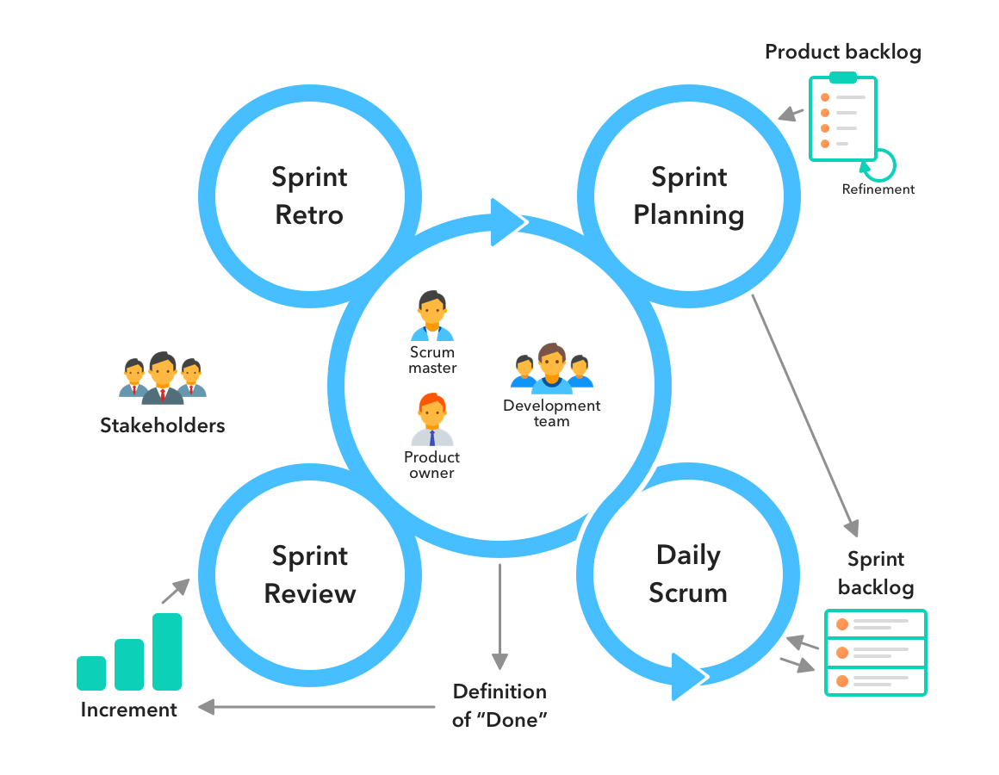

# **PM-notes**

## **44-618-002 PM4**

### **Scrum**
* Scrum is the leading agile development method for completing projects with a complex, innovative scope of work
* The Scrum Team consists of one Scrum Master, one Product Owner, and Developers
* The developers carry out all work required to build increments of value every sprint

### **Scrum Events:**
1. Sprint
2. Sprint planing
3. Daily Scrum
4. Sprint Review
5. Sprint Retrospective

### **Scrum Cycle:**

